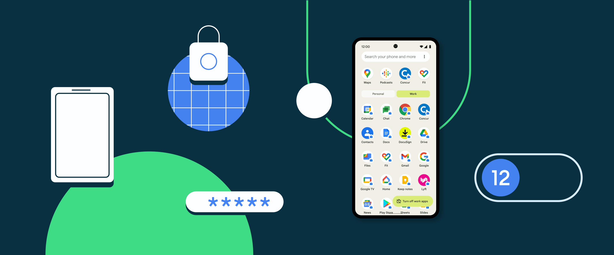

### Hello there 
### I am Naman Khurana - C++ Engineer

<h3 align="left">Connect with me:</h3>

 
 

- 🔭 I’m currently working on C++ and Embedded Applications
- 🌱 I’m currently learning OOPS and Modern C++ Concepts
- 👯 I’m looking to collaborate on C++ and Embedded Application Projects
- 🤔 I’m looking for help with bugs and problem occurs during Embedded Development
- 💬 Ask me about Mobile Apps,I am happy to help;
- 📫 How to reach me: Ping me on [Phone](mailto:+917017251685) or on  [email](mailto:namankhurana9083@gmail.com) :)
- 😄 Pronouns: ...
- ⚡ Fun fact: No one other better understands the code of a problem than his writer

<!--   -->
 
 

 
 

<!-- - 💼 any freelance work? do reach, [email](mailto:namankhurana9083@gmail.com) :) -->

<!-- Actual text -->

<!--    -->

<!--    -->

 

- 📈 GitHub stats

 
  

 
- 📈 GitHub Trophies

 

 
 

  

  

 🙊 A little laughter for you

