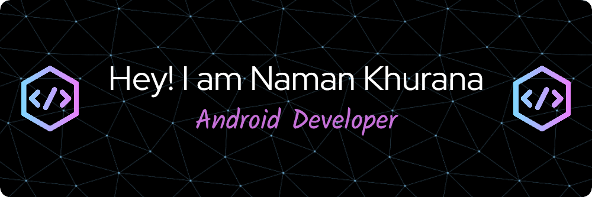

### Hello there 

- 🔭 I’m currently working on Mobile Applications
- 🌱 I’m currently learning Flutter and Native Android
- 👯 I’m looking to collaborate on Mobile App Projects
- 🤔 I’m looking for help with bugs and problem occurs during App Development
- 💬 Ask me about Mobile Apps,i am happy to help;
- 📫 How to reach me: Ping me on +917017251685 or on namankhurana9083@gmail.com
- 😄 Pronouns: ...
- ⚡ Fun fact: No one other better understands the code of a problem than his writer

 
 
 

- 💼 any freelance work? do reach, [email](mailto:namankhurana9083@gmail.com) :)

<!-- Actual text -->

You can find me on [![Twitter][1.2]][1], or on [![LinkedIn][2.2]][2].

<!-- Icons -->

[1.2]: http://i.imgur.com/wWzX9uB.png (twitter icon without padding)
[2.2]: https://raw.githubusercontent.com/MartinHeinz/MartinHeinz/master/linkedin-3-16.png (LinkedIn icon without padding)

<!-- Links to your social media accounts -->

[1]: https://twitter.com/Naman07679921
[2]: https://www.linkedin.com/in/naman-khurana-b016a3210/
